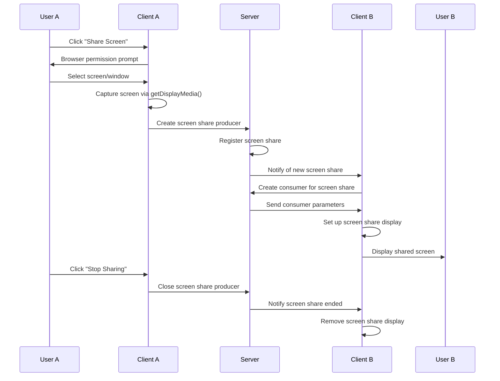

# Design Document: Screen Sharing Feature

## Overview

This document outlines the design for implementing screen sharing functionality in our WebRTC-based video conferencing application. The screen sharing feature will allow participants to share their screen content with others in the same room, enabling presentations, demonstrations, and collaborative work.

The implementation will leverage the existing mediasoup infrastructure, which already handles audio and video streams for regular calls. Screen sharing will be treated as a special type of video producer/consumer relationship within the mediasoup framework.

## Architecture

The screen sharing feature will be integrated into the existing client-server architecture:

1. **Client-side (Frontend)**:

   - Capture screen content using the browser's `getDisplayMedia()` API
   - Create and manage screen sharing producers
   - Consume and display screen shares from other participants
   - Provide UI controls for starting/stopping screen sharing

2. **Server-side (Backend)**:
   - Handle screen sharing transport creation and connection
   - Manage screen sharing producers and consumers
   - Route screen sharing streams to appropriate participants
   - Track active screen shares within rooms

### System Flow



## Components and Interfaces

### Frontend Components

1. **Screen Sharing Button**

   - Added to the existing media controls component
   - Toggles between "Share Screen" and "Stop Sharing" states

2. **Screen Share Display Component**

   - Renders shared screens from other participants
   - Handles multiple shared screens if applicable
   - Provides visual indicators of who is sharing

3. **useScreenShare Hook**
   - Manages screen sharing state and operations
   - Interfaces with the mediasoup client for producer creation

### Backend Components

1. **Screen Share Producer Management**

   - Extension of existing producer handling to support screen share type
   - Special handling for screen share producers (potentially higher bitrate/resolution)

2. **Screen Share Consumer Distribution**
   - Logic to create consumers for all participants when a screen share starts
   - Handling of screen share consumer cleanup when sharing stops

### API Extensions

1. **WebSocket Events**:
   - `start-screen-share`: Client requests to start sharing screen
   - `screen-share-started`: Server notifies all clients of new screen share
   - `stop-screen-share`: Client requests to stop sharing screen
   - `screen-share-stopped`: Server notifies all clients of ended screen share

## Data Models

### Extended Room Peer Model

```typescript
interface RoomPeer {
  id: string;
  transports: Transport[];
  producers: Producer[];
  consumers: Consumer[];
  dataProducers: DataProducer[];
  dataConsumers: DataConsumer[];
  screenShareProducer?: Producer; // New field for screen sharing
}
```

### Screen Share Producer Data

```typescript
interface ScreenShareProducer {
  producerId: string;
  peerId: string;
  kind: "video";
  appData: {
    mediaType: "screenShare";
    peerId: string;
  };
}
```

## Error Handling

1. **Permission Denial**:

   - Handle cases where users deny screen sharing permissions
   - Provide clear feedback and recovery options

2. **Screen Share Failures**:

   - Detect and handle failures in screen capture
   - Implement automatic recovery or graceful degradation

3. **Connection Issues**:
   - Handle network interruptions during screen sharing
   - Attempt reconnection or gracefully end the screen share

## Testing Strategy

1. **Unit Tests**:

   - Test screen sharing hooks and components in isolation
   - Verify proper state management and UI updates

2. **Integration Tests**:

   - Test the interaction between frontend and backend for screen sharing
   - Verify proper producer/consumer creation and management

3. **End-to-End Tests**:

   - Test complete screen sharing flow with multiple participants
   - Verify screen content is properly displayed to all participants

4. **Performance Tests**:
   - Measure impact of screen sharing on call quality
   - Test with various screen resolutions and content types
   - Verify behavior under network constraints
